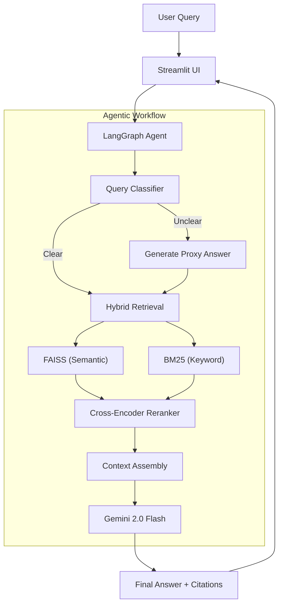
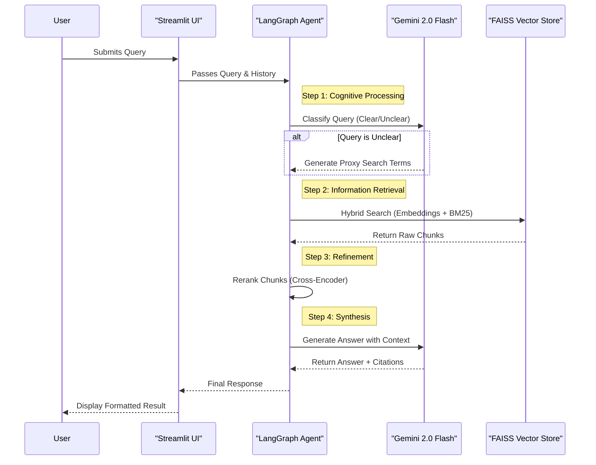

# 🍔 Swiggy Annual Report RAG - Advanced Q&A System


A production-grade Retrieval-Augmented Generation (RAG) system engineered to provide accurate, citation-backed answers from the **Swiggy Annual Report FY 2023-24**. This system leverages **LangGraph** for agentic orchestration, **Hybrid Retrieval** (Dense + Sparse) for high recall, and **Cross-Encoder Reranking** for high precision.

---

## 🚀 Key Features

### 🧠 Intelligent Agentic Core
- **LangGraph Orchestration**: Uses a stateful graph to manage the cognitive flow (Routing → Retrieval → Evaluation → Generation).
- **Self-Correction**: Automatically detects if retrieval quality is low and iteratively refines the query.
- **Query Classification**: Distinguishes between "Clear" queries (direct lookup) and "Unclear" queries (needing proxy answer expansion).

### 🔍 Advanced Retrieval System
- **Hybrid Search**: Combines **FAISS** (Dense/Semantic search) and **BM25** (Sparse/Keyword search) to handle both conceptual questions and specific keyword lookups.
- **Cross-Encoder Reranking**: Re-scores the top retrieved chunks using a `ms-marco-MiniLM` cross-encoder to rigorously filter out irrelevant context.
- **Full-Text Access**: Provides "Show Full Chunk" functionality in the UI to inspect the raw source text for transparency.

### 📊 Financial Understanding
- **Table Extraction**: Specialized processing for financial tables using `pdfplumber` to preserve row/column structure.
- **Grounded Generation**: Answers are strictly grounded in the retrieved context to prevent hallucinations.
- **Citation Engine**: Every claim is backed by a specific page number citation.

### 🎨 Premium User Experience
- **Streamlit UI**: Dark-themed, responsive interface with custom CSS.
- **Confidence Meter**: Visual indicator of the model's confidence in its answer.
- **Interactive Citations**: Hoverable and expandable source cards.
- **Export Options**: Download full Q&A sessions as JSON or TXT.

---

## 🏗️ System Architecture

The application follows a modular architecture separating concern between data processing, retrieval logic, and user interaction.



## 🔄 Flow of Information

The following sequence diagram illustrates the lifecycle of a single user query, showing how data flows between the user, the agent, and the underlying storage systems.



### 📝 Step-by-Step Data Pipeline

1.  **Ingestion & Chunking**:
    *   The raw PDF is text-mined using `PyMuPDF`.
    *   Tables are separately extracted using `pdfplumber` to maintain row/column alignment.
    *   Text is split into semantic chunks (default: 1024 chars) with overlap to preserve context.

2.  **Indexing**:
    *   Each chunk is embedded into a 768-dimensional vector using `gemini-embedding-001`.
    *   Vectors are indexed in **FAISS** for millisecond-latency similarity search.
    *   A parallel **BM25** index is built for keyword-based lookup.

3.  **Retrieval & Ranking**:
    *   **Hybrid Search**: The system queries both FAISS (semantic) and BM25 (keyword) indices.
    *   **Score Fusion**: Results are merged using weighted reciprocal rank fusion (Default: 60% Dense, 40% Sparse).
    *   **Reranking**: The top 10 results are re-evaluated by a Cross-Encoder model to strictly filter out false positives.

4.  **Generation**:
    *   The top validated chunks are assembled into a context prompt.
    *   Gemini 2.0 generates the final answer, strictly adhering to the provided context and adding inline citations.

## 🧠 LangGraph Decision Flow

The agent logic is implemented as a state graph (`app/langgraph_agent.py`):

1.  **Start Node**: Receives user query.
2.  **Classification Node**:
    *   *Input*: "What is the revenue?" -> *Output*: `CLEAR`
    *   *Input*: "How much?" -> *Output*: `UNCLEAR`
3.  **Proxy Node (Conditional)**: If query is `UNCLEAR`, generates a hypothetical "proxy answer" to enrich the query with relevant financial keywords before retrieval.
4.  **Retrieval Node**: Fetches top-$k$ chunks using Hybrid Search.
5.  **Evaluation Node**: Checks retrieval scores. If average relevance < 0.3, it triggers a **Retry Loop** (up to 2 iterations) using query expansion.
6.  **Generation Node**: Synthesizes the final answer using strictly the retrieved context.

## 🛠️ Technical Stack

| Component | Technology | Rationale |
| :--- | :--- | :--- |
| **LLM** | Google Gemini 2.0 Flash | High speed, large context window (1M tokens), and cost-effective. |
| **Embeddings** | `gemini-embedding-001` | 768-dim embeddings optimized for semantic retrieval. |
| **Orchestration** | LangGraph | Enables cyclic, stateful agent workflows (loops, retries). |
| **Vector Store** | FAISS (IndexFlatIP) | Industry standard for fast, exact inner-product search. |
| **Reranker** | `cross-encoder/ms-marco-MiniLM-L-6-v2` | Dramatically improves precision by scoring query-doc pairs together. |
| **PDF Engine** | PyMuPDF + pdfplumber | PyMuPDF for fast text; pdfplumber for accurate table structure preservation. |
| **UI Framework** | Streamlit | Rapid frontend development with Python. |

## 📂 Project Structure

```
e:/RAG/
├── app/
│   ├── config.py              # Configuration & env vars
│   ├── document_processor.py  # PDF ingestion & chunking logic
│   ├── vector_store.py        # FAISS wrapper
│   ├── embeddings.py          # Gemini embedding client
│   ├── retriever.py           # Hybrid retrieval implementation
│   ├── generator.py           # Answer synthesis & citation logic
│   └── langgraph_agent.py     # Main agent workflow
├── data/
│   └── vectorstore/           # Persisted FAISS index & metadata
├── ui/
│   ├── streamlit_app.py       # Main web application
│   └── cli.py                 # Terminal-based testing tool
├── exports/                   # Directory for session exports
├── requirements.txt           # Python dependencies
└── README.md                  # Documentation
```

## 🚀 Getting Started

### Prerequisites
- Python 3.10+
- A Google Cloud API Key (for Gemini)

### Installation

1.  **Clone the repository**
2.  **Install dependencies**:
    ```bash
    pip install -r requirements.txt
    ```
3.  **Configure Environment**:
    Create a `.env` file in the root directory:
    ```env
    GOOGLE_API_KEY=your_key_here
    GEMINI_MODEL=gemini-2.0-flash
    CHUNK_SIZE=1024
    CHUNK_OVERLAP=124
    ```

### Usage

1.  **Prepare the Data**:
    Place your `Annual-Report-FY-2023-24.pdf` in the project root.

2.  **Run the Web App**:
    ```bash
    streamlit run ui/streamlit_app.py
    ```
    The app will automatically:
    - Load the PDF
    - Extract text and tables
    - Generate embeddings
    - Build the FAISS index (saved to `data/vectorstore`)

3.  **Run via CLI** (Optional):
    ```bash
    python ui/cli.py
    ```

## 🧩 Advanced Configuration

-   **Chunking**: Adjusted in `.env` via `CHUNK_SIZE` and `CHUNK_OVERLAP`. Default is 1024/124, optimized for capturing complete paragraphs/tables.
-   **Retrieval Parameters**:
    -   `TOP_K_RETRIEVAL`: Number of chunks to fetch (default: 10).
    -   `dense_weight` vs `sparse_weight`: Adjusted in `app/retriever.py` (default: 0.6 / 0.4).

## 📄 License
MIT License.
